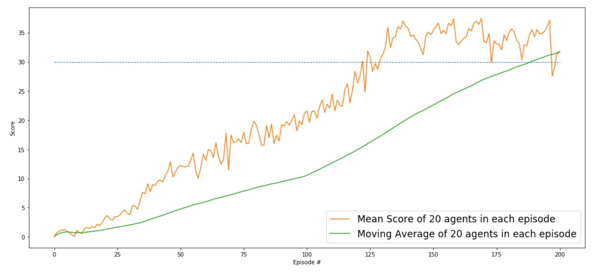

# Deep Reinforcement learning Continuous Control

The project focusses on training an agent whose action space is continous in nature. The environment which is being used here is the reacher environment. The goal of the project is to have a mechanical hand to move to desired points in 3D space. The hand is controlled at two joints by the corresponding x and y torque which is needed to be applied. The observation space consists of 33 variables corresponding to position,rotation, velocity and angular velocities of the arm. The training here is perfomed by using only a single arm or by distributing the model over 20 identical arms and training.

<h3>Single agent </h3>


<h3>Multi agent </h3>


<h2>Goal</h2>

The environment is considered solved when the below condition based on the number of agent is satisfied.

<h3>Single agent</h3>

The task is episodic, and in order to solve the environment, your agent must get an average score of +30 over 100 consecutive episodes.

<h3>Multi agent </h3>

The barrier for solving the second version of the environment is slightly different, to take into account the presence of many agents. In particular, your agents must get an average score of +30 (over 100 consecutive episodes, and over all agents). Specifically,

After each episode, we add up the rewards that each agent received (without discounting), to get a score for each agent. This yields 20 (potentially different) scores. We then take the average of these 20 scores.
This yields an average score for each episode (where the average is over all 20 agents).

<h2>Model</h2>

We combine the benefits of both policy based approach and value based approach to come up with Actor Critic Methods. For solving this environment, DDPG (Deep Deterministic policy gradient) model is used.

<h2>Bias and Variance</h2>

The bias introduce a guessing factor to the output of the model. On the other hand the variance describes how much the model output differ from a particular value.

<h3>Higher Bias and Lower Variance</h3>

The target value is marked in red. Here the model guess a value somewhere below the target which causes a bias to shoot the ball lower. The variance is less as the model predicts values closer the biased point. 


<h3>Lower Bias and Higher Variance</h3>

The model predicts most of the value near the target value and so the bias is low.But for each prediction the output values are far different causing higher variance.


<h3>High Bias and High Variance</h3>

The model predicts with high variance and with high bias away from target.


<h3>Low Bias and Low Variance</h3>

The model predicts with low bias and lower variance and this model is suitable for deployment.


<h2>Actor Critic Methods</h2>

In value based methods such as Q learning using DNN the agent is learning to estimate situations and actions. For example in training an agent to play game of tennis, the agent start playing tennis. Suppose if there a 4 actions the agent learns to assign a score for each particular action based on the final reward. This forms a q table with rows for each states and columns for each actions.
Using this table the agent can choose the particular action for each state.

Here the problem with value based methods is that, guesses introduce a bias because they are sometimes wrong due to lack of experience especially at starting few episodes of training. So it can under estimate or over estimate.But guesses are consistent through time. If it guesses to win in 5 minutes into it, it will win 10 minutes into it. So TD methods have low variance.

On the other hand the policy based methods the agent directly learns the policy using the DNN. For each state given to the network,it output the probability of each actions. The agent randomly takes actions in environment and corresponding reward is stored in the buffer. After some batch size the agent recalls each reward for each action and compares with the target value and train.

Here the problem with policy based methods is that, it needs lot of data to learn useful policy. Since the model penalizes each action which is being used in the policy either good or bad only because the agent lost the game at final stage. So only if we repeat this infinite number of times the model can learn useful policy.This causes slow learning. So the policy based approach has high variance but lower bias.

So we combine both value based and policy based method to form actor critic methods which has the advantage of lower variance due to value based methods(critic) and lower bias due to policy based methods(actor).

<h2>Basic Actor Critic Agent</h2>

The model uses two Deep neural network, one for actor and other for critic.


The observed state of the environment is fed to the actor neural network. The Actor uses policy based methods and learns the policy. The output of the actor model is the probability value of each action. The highest probability action is taken. The reward and next state is obtained from the environment.


Now with the current state,current state,reward and next state we train the critic. We pass the current state along the action probabilities from the actor model to the critic as input.The critic predicts the Q value of that particular action. The critic is trained to predict the maximum reward which will be obtained(score)of each action similar to Q learning.

<h2>DDPG for continous action space</h2>

We use two separate actor and critic models for performing the training. The actor model uses two layers of Dense neural network of 128 nodes. It predicts a continous value in the range of -1 to 1 using the tanh activation function. It gives 4 continous values for each x and y torques of both the arms.

The critic model is takes input of state in the first dense layers of 128 neurons. In the second layer we include the probabilities of each action from the actor model along the output of first dense layer. We fed this to 128 neurons dense layer.Finally it outputs a single value using the Relu activation layer which gives the score of that action.

The actor and the critic model are initialized using Xavier initialization. The final layer (Fc3 layer) is alone initialized with uniform distribution in the range of -3e-3 to 3e-3.

<h2>Model architecture</h2>

<h3>Actor model</h3>

```
Actor(
  (fc1): Linear(in_features=33, out_features=128, bias=True)
  (fc2): Linear(in_features=128, out_features=128, bias=True)
  (fc3): Linear(in_features=128, out_features=4, bias=True)
)

```

<h3>Critic Model</h3>

```
Critic(
  (fc1): Linear(in_features=33, out_features=128, bias=True)
  (fc2): Linear(in_features=132, out_features=128, bias=True)
  (fc3): Linear(in_features=128, out_features=1, bias=True)
)

```

<h2>Training</h2>

The actor and critic model are trained with reference to a target actor and critic model which gets updated after certain iterations. This prevents the moving targets problem while training. After certain iterations we perform soft update to our target model using the local model with some probability.

While training we add some amount fo noise to preserve the environment exploration. We use Ornstein-Uhlenbeck process for adding noise to our output actions of the actor.

The model is trained for 3000 episodes with max steps for each episode be 1000.

<h2>Hyperparameters</h2>

```
BUFFER_SIZE = int(1e5) // Replay buffer size
BATCH_SIZE = 128
GAMMA = 0.99 
TAU = 1e-3 //soft update intensity
LR_ACTOR = 1e-3 //learning rate of actor
LR_CRITIC = 1e-3 //learning rate of critic
WEIGHT_DECAY = 0 
EPSILON = 1.0 //Epsilon decay policy
EPSILON_DECAY = 1e-6
SEED = 0

LEARN_EVERY = 10 //Iterations after with soft update to target network is performed.

```

<h2>Implementation</h2>

The model is being trained in Udacity environment with the above hyperparameters. The model is trained for single agent as well as multi agent. The same model and hyperparameters are used for both single and multi agent training.

<h2>Single agent training</h2>

The unity environment for the project is provided by Udacity. The below links are for various OS.

<ul>
<li>Linux: <a target="_blank" href="https://s3-us-west-1.amazonaws.com/udacity-drlnd/P2/Reacher/one_agent/Reacher_Linux.zip">click here</a></li>
<li>Mac OSX: <a target="_blank" href="https://s3-us-west-1.amazonaws.com/udacity-drlnd/P2/Reacher/one_agent/Reacher.app.zip">click here</a></li>
<li>Windows (32-bit): <a target="_blank" href="https://s3-us-west-1.amazonaws.com/udacity-drlnd/P2/Reacher/one_agent/Reacher_Windows_x86.zip">click here</a></li>
<li>Windows (64-bit): <a target="_blank" href="https://s3-us-west-1.amazonaws.com/udacity-drlnd/P2/Reacher/one_agent/Reacher_Windows_x86_64.zip">click here</a></li>
</ul>

To run the project.

<h3>Environment Setup</h3>

```
Install anaconda python

Create new conda environment
conda create -n ml-agents python=3.6
conda activate ml-agents

Install Cuda toolkit and CuDNN library
Cuda 11.2.2
cuDNN 8.1.0

pip install tensorflow-gpu
conda install pytorch torchvision torchaudio cudatoolkit=11.0 -c pytorch
pip install unityagents
pip install mlagents

move to the path
jupyter notebook <ipynb file name>

```
<h3>Training and testing of Single agent

```
Clone this repo and place the simulator inside the folder of the project(already done for Windows).

To Run training.
Go to Single agent folder
jupyter notebook Continuous_Control_new_1.ipynb

To Run testing.
Go to Single agent folder
jupyter notebook Testing.ipynb

```

<h3>Results</h3>

The model solved the environment in 1200 episodes with the average score for 100 episoded being 33.42


<h3>Testing</h3>

To test the model,use Testing.ipynb notebook. The simulator can run only once each time the kernel is opened as once the environment is closed the port is lost. So each time we need to restart kernel and run.

```
Video link
https://youtu.be/rMFq80yOBtQ

```

<h2>Multi agent</h2>

The unity simulator is provided by Udacity for this project. Multi agent simualtor can be downloaded in the below links for various OS.

<ul>
<li>Linux: <a target="_blank" href="https://s3-us-west-1.amazonaws.com/udacity-drlnd/P2/Reacher/Reacher_Linux.zip">click here</a></li>
<li>Mac OSX: <a target="_blank" href="https://s3-us-west-1.amazonaws.com/udacity-drlnd/P2/Reacher/Reacher.app.zip">click here</a></li>
<li>Windows (32-bit): <a target="_blank" href="https://s3-us-west-1.amazonaws.com/udacity-drlnd/P2/Reacher/Reacher_Windows_x86.zip">click here</a></li>
<li>Windows (64-bit): <a target="_blank" href="https://s3-us-west-1.amazonaws.com/udacity-drlnd/P2/Reacher/Reacher_Windows_x86_64.zip">click here</a></li>
</ul>

<h3>Environment Setup</h3>

```
Install anaconda python

Create new conda environment
conda create -n ml-agents python=3.6
conda activate ml-agents

Install Cuda toolkit and CuDNN library
Cuda 11.2.2
cuDNN 8.1.0

pip install tensorflow-gpu
conda install pytorch torchvision torchaudio cudatoolkit=11.0 -c pytorch
pip install unityagents
pip install mlagents

move to the path
jupyter notebook <ipynb file name>

```
<h3>Training and testing of Multi agent

```
Clone this repo and place the simulator inside the folder of the project(already done for Windows).

To Run training.
Go to Multi agent folder
jupyter notebook Continuous_Control_multiagent.ipynb

To Run testing.
Go to Multi agent folder
jupyter notebook Testing.ipynb

```

<h3>Results</h3>

For the same hyperparameters as like Single agents, since multiple agents are used to train the environment gets solved faster. The model solves the environment in 200 episodes with an average score of all agents over 100 episodes is 31.60.



The train results of each agent is plotted below.


<h3>Testing</h3>

To test the model,use Testing.ipynb notebook. The simulator can run only once each time the kernel is opened as once the environment is closed the port is lost. So each time we need to restart kernel and run.

```
Video link
https://youtu.be/epX8-yMP9fA

```

<h2>Future Improvements</h2>

The model can be trained with various actor critic methods like A3C, A2C, D4PG and performance of various models can be summarized. All the above actor critic method use distributed training using many agents rathe than a single agent. Also the agent can be further improved to mimic a real robotic arm having many joints and trained for any particula task to see the performance while using real world robotic arms.
